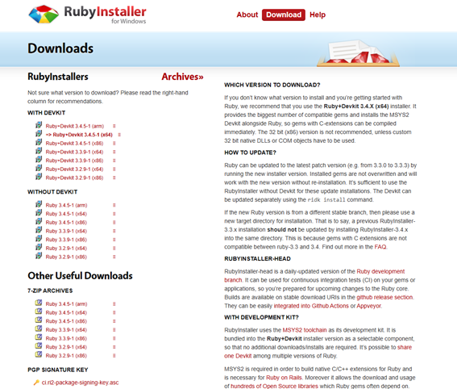
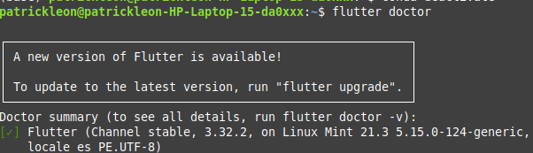
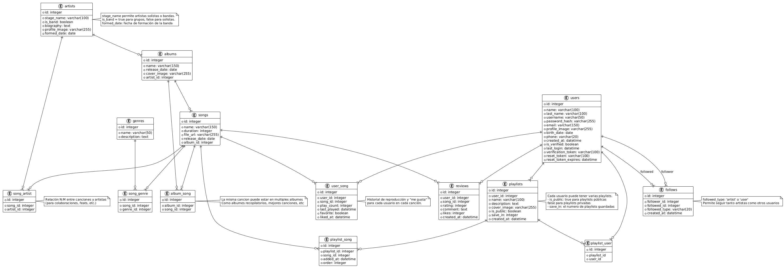
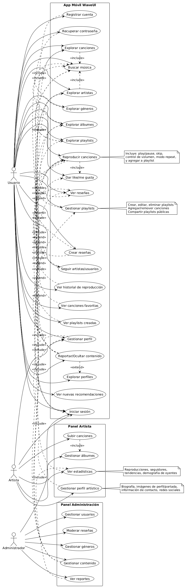
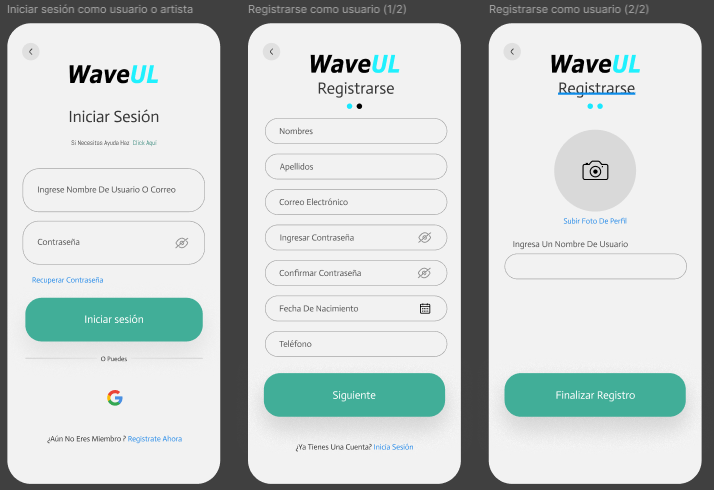
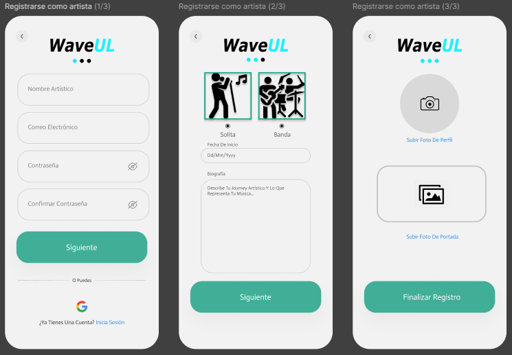
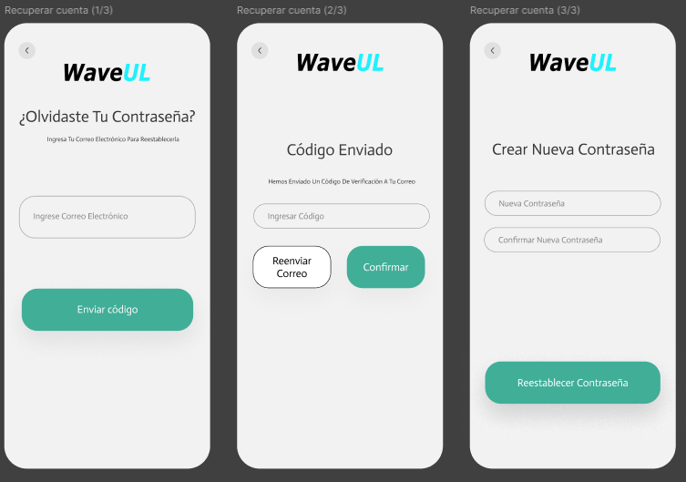

# App WaveUl

## Descripción

WaveUl es una aplicación móvil desarrollada en Flutter para Android que funciona como una plataforma de streaming musical integral, permitiendo a los usuarios explorar, escuchar y gestionar sus canciones y playlists favoritas online. La aplicación ofrece una experiencia personalizada donde los oyentes pueden mantener un perfil detallado, descubrir nuevos artistas y álbumes a través de un catálogo organizado por géneros, y valorar sus canciones con funciones de “me gusta” e historial de reproducciones. El caso de negocio se centra en democratizar el acceso a la música, proporcionando una plataforma centralizada y fácil de usar que fomente la interacción musical y sirva como puente entre artistas, productores y el público final.

El backend, construido con Ruby y el framework Sinatra, junto con una base de datos SQLite3, sirve como el núcleo robusto y eficiente que soporta todas las operaciones de la aplicación. Gestiona de forma ágil la autenticación de usuarios, las transacciones de datos de canciones, álbumes, artistas y playlists, además del procesamiento de estadísticas de reproducción. Este sistema está diseñado para ser escalable y de alto rendimiento, garantizando una experiencia fluida y responsiva para el usuario final, mientras que su simplicidad y bajo costo de operación se alinean con el objetivo de negocio de ofrecer un servicio sostenible y de calidad.

## Configuración del Ambiente de Desarrollo

1. Configuración del backend en Ruby

    Descargar Ruby Windows Installer del <a href="https://rubyinstaller.org/downloads/">Sitio Oficial</a> como se aprecia en la Imagen 1.
    
    <b>Figura 1: Sitio Web de RWI</b>

    -Instalar Ruby y asegurarse de marcar la opción para instalar MSYS2.

    -Verificar la instalación con el siguiente comando: ruby -v
    
    -Instalar Sinatra y las dependencias necesarias:
    gem install sinatra sqlite3

2. Configuración del Entorno Flutter

    Descargar Flutter SDK desde el <a href="https://docs.flutter.dev/get-started/install">sitio oficial</a>.

    Extraer el SDK en una carpeta de fácil acceso (ejemplo: C:\src\flutter).

    Configurar la variable de entorno PATH agregando la ruta a la carpeta flutter\bin.

    Verificar la instalación ejecutando:
    
    
    Crear proyecto con flutter: 
    flutter create waveul

---
## Diagrama de despliegue

El diagrama de despliegue de **WaveUI** presenta la arquitectura de la aplicación móvil desarrollada en Flutter, que se conecta a un backend en Sinatra (Ruby) mediante una API REST segura. La aplicación utiliza de los servicios de Google OAuth 2.0  para autenticación y Gmail SMTP para el envío de correos de verificación y recuperación. Los datos se almacenan en una base de datos SQLite3, y el flujo de información entre componentes se detalla a continuación.

<b>Figura 1: Diagrama de despliegue de WaveUl</b> 

### Nodos y Componentes (Despliegue)

A continuación, se presenta la descripción de cada
nodo y componente de la aplicación móvil WaveUI:

### 1. Nodos

- **Dispositivo Móvil (Usuario)**: El dispositivo móvil que ejecuta la aplicación apk WaveUI desarrollada en Flutter, proporcionando la interfaz de usuario para interactuar con la plataforma musical.

- **Servidor Backend**: El servidor que maneja las solicitudes de la aplicación, donde se ejecuta el backend y la base de datos, gestionando la lógica de negocio y la autenticación de los usuarios

- **Google**: Nodo que representa los servicios de Google utilizados en el sistema. Contiene los servicios de autenticación y correo electrónico.

### 2. Componentes

- **WaveUI_App.apk**: El software que se ejecuta en el dispositivo móvil, desarrollado en Flutter, que permite a los usuarios interactuar con la plataforma musical y consume la API REST.

- **SQLite3 DB**: La base de datos donde se almacenan los datos de la aplicación, como la información de usuarios, canciones, artistas o playlists.

- **API WaveUI (Sinatra/Ruby)**: El componente que maneja las solicitudes REST de la aplicación móvil y se ejecuta dentro del servidor backend. Utiliza Sinatra (Ruby) como framework.

- **Google OAuth 2.0**: Servicio que permite a los usuarios iniciar sesión de forma segura en WaveUI utilizando sus cuentas de Google, simplificando el proceso de autenticación.

- **Gmail SMTP**: Servicio que permite enviar correos electrónicos desde WaveUI, utilizado para la verificación de cuentas y recuperación de contraseñas.

---

## Requerimientos Funcionales

A continuación, se detallan los **requerimientos funcionales** de WaveUl, alineados con los casos de uso:  

### 1. Autenticación y Perfil  
- **RF-01**: El sistema debe permitir registrar una cuenta con email o autenticación mediante Google OAuth.  
- **RF-02**: El sistema debe permitir la recuperación de contraseña mediante token enviado por correo (Gmail SMTP).  
- **RF-03**: El sistema debe permitir editar datos de perfil (nombre, foto, descripción, privacidad).  

### 2. Exploración y Descubrimiento  
- **RF-04**: El sistema debe mostrar un catálogo general de canciones, álbumes, playlists, artistas y géneros.  
- **RF-05**: El sistema debe permitir búsquedas avanzadas por nombre, artista, álbum o género.  
- **RF-06**: El sistema debe mostrar la discografía de un artista en su perfil.  
- **RF-07**: El sistema debe clasificar las canciones según género.  
- **RF-08**: El sistema debe mostrar playlists destacadas y públicas.  
- **RF-9**: El sistema debe permitir visitar perfiles de otros usuarios.  

### 3. Reproducción e Interacción  
- **RF-10**: El sistema debe permitir reproducir canciones con controles de play/pause, skip, repeat y volumen.  
- **RF-11**: El sistema debe permitir gestionar playlists (crear, editar, eliminar, compartir).  
- **RF-12**: El sistema debe permitir dar “me gusta” a canciones y reseñas.  
- **RF-13**: El sistema debe permitir a los usuarios crear reseñas con calificación y comentarios.  
- **RF-14**: El sistema debe mostrar las reseñas de cada canción.  
- **RF-15**: El sistema debe permitir seguir a artistas y usuarios.  
- **RF-16**: El sistema debe permitir reportar canciones, usuarios, playlists o reseñas.  

### 4. Biblioteca Personal  
- **RF-17**: El sistema debe registrar y mostrar el historial de canciones reproducidas.  
- **RF-18**: El sistema debe mostrar las canciones marcadas como favoritas.  
- **RF-19**: El sistema debe mostrar y permitir gestionar playlists creadas por el usuario.  
- **RF-20**: El sistema debe generar recomendaciones basadas en hábitos de escucha.  

### 5. Panel del Artista  
- **RF-21**: El sistema debe permitir a los artistas editar su perfil artístico (biografía, imágenes, redes sociales).  

---
## Modelo Relacional (ERD)

A continuación, se presenta el modelo relacional de **WaveUl**, que organiza la información en torno a usuarios, artistas, canciones, playlists y sus interacciones.  

  
<b>Figura 2: Modelo Relacional de WaveUl</b>  

### Entidades Principales  
- **users**: Información detallada del usuario, incluyendo perfil, credenciales, verificación, actividad, y preferencias.  
- **admins**: Subtipo de usuario con roles específicos para administración, como superadmin y moderador, con permisos para gestionar el contenido y usuarios.  
- **artists**: Representación de artistas, ya sean solistas o bandas, con su nombre artístico, biografía, imagen y fecha de formación.  
- **albums**: Colecciones de canciones, con referencias a los artistas que las componen, fecha de lanzamiento, y género.  
- **songs**: Canciones individuales con su nombre, duración, archivo, metadatos (como nombre del álbum y género), y fecha de lanzamiento.  
- **genres**: Clasificación de las canciones según el género musical (rock, pop, hip hop, etc.).  
- **playlists**: Listas de reproducción creadas por usuarios, que pueden ser públicas o privadas, con canciones agregadas por los usuarios.  
- **reviews**: Opiniones y valoraciones de canciones, con calificación numérica y comentarios escritos por los usuarios.  
- **follows**: Relación que permite a los usuarios seguir tanto a artistas como a otros usuarios para recibir actualizaciones de su actividad.  
- **reports**: Registros que almacenan reportes de contenido inapropiado, como canciones, listas de reproducción o reseñas.  

### Entidades de Relación  
- **album_song**: Relación N:M entre álbumes y canciones, lo que permite que un álbum tenga múltiples canciones y una canción pueda pertenecer a varios álbumes.  
- **song_genre**: Relación N:M entre canciones y géneros musicales, permitiendo que una canción esté clasificada en varios géneros.  
- **song_artist**: Relación N:M entre canciones y artistas, para registrar colaboraciones y artistas invitados en canciones.  
- **user_song**: Registro de las interacciones entre el usuario y las canciones, incluyendo la cantidad de reproducciones, canciones favoritas, y la última vez que una canción fue escuchada.  
- **playlist_song**: Relación entre playlists y canciones, que también almacena el orden y la fecha en la que una canción fue añadida a una playlist.  
- **playlist_user**: Relación que permite que varios usuarios colaboren en la creación y modificación de playlists compartidas.  
- **review_likes**: Relación entre usuarios y reseñas, donde los usuarios pueden dar "me gusta" a una reseña publicada por otro usuario.

## Casos de Uso - WaveUl

El sistema WaveUl se organiza en torno a tres tipos de actores principales:

- **Usuario** : oyente de música que explora, reproduce e interactúa con canciones, playlists y artistas.  
- **Artista** : creador de contenido musical, con acceso a herramientas para gestionar su perfil artístico, canciones y estadísticas.  
- **Administrador** : encargado de la moderación, gestión de usuarios y control del catálogo musical.  

  
**Figura 3: Diagrama de Casos de Uso de WaveUl**

---

###  Autenticación y Perfil
- **Registrar cuenta (UC1)**: permite a nuevos usuarios crear un perfil en la app.  
- **Iniciar sesión (UC2)**: acceso de usuarios, artistas y administradores a sus respectivos paneles.  
- **Recuperar contraseña (UC3)**: recuperación mediante correo/token de verificación.  
- **Gestionar perfil (UC4)**: actualización de información personal, foto de perfil y ajustes de seguridad.  

---

###  Exploración y Descubrimiento
- **Explorar canciones (UC5)**: navegar por el catálogo general.  
- **Buscar música (UC6)**: búsqueda avanzada por nombre, género, artista o álbum.  
- **Explorar artistas (UC7)**: consulta de perfiles artísticos y discografía.  
- **Explorar géneros (UC8)**: descubrimiento de música organizada por categorías musicales.  
- **Explorar álbumes (UC9)**: visualización de discos publicados por artistas.  
- **Explorar playlists (UC27)**: acceso a playlists públicas y destacadas.  
- **Explorar perfiles (UC28)**: posibilidad de visitar perfiles de otros usuarios.  

---

###  Reproducción e Interacción
- **Reproducir canciones (UC10)**: incluye controles de play/pause, skip, volumen, repeat y añadir a playlists.  
- **Gestionar playlists (UC11)**: crear, editar, eliminar, compartir y organizar playlists.  
- **Dar like/me gusta (UC12)**: marcar canciones o reseñas como favoritas.  
- **Crear reseñas (UC13)**: permitir a los usuarios opinar y valorar canciones.  
- **Ver reseñas (UC31)**: lectura de comentarios y puntuaciones de la comunidad.  
- **Seguir artistas/usuarios (UC14)**: suscripción a contenido de interés.  
- **Reportar/Ocultar contenido (UC29)**: denunciar o bloquear canciones, usuarios, reseñas o playlists.  

---

###  Biblioteca Personal
- **Ver historial de reproducción (UC15)**: acceso al registro de canciones escuchadas.  
- **Ver canciones favoritas (UC16)**: listado de temas marcados con “me gusta”.  
- **Ver playlists creadas (UC17)**: gestión de playlists propias.  
- **Ver nuevas recomendaciones (UC30)**: sugerencias personalizadas basadas en hábitos de escucha.  

---

###  Panel del Artista
- **Gestionar perfil artístico (UC18)**: edición de biografía, imágenes, redes sociales y datos de la banda/solista.  
- **Subir canciones (UC19)**: carga de pistas nuevas al catálogo.  
- **Gestionar álbumes (UC20)**: creación y edición de álbumes.  
- **Ver estadísticas (UC21)**: análisis de reproducciones, seguidores, demografía y tendencias.  

---

###  Panel de Administración
- **Gestionar usuarios (UC22)**: alta, baja o suspensión de cuentas.  
- **Gestionar contenido (UC23)**: control sobre canciones, álbumes y artistas cargados.  
- **Moderar reseñas (UC24)**: validación y moderación de opiniones de la comunidad.  
- **Gestionar géneros (UC25)**: administración de categorías musicales.  
- **Ver reportes (UC26)**: análisis y seguimiento de contenido denunciado.  

---

## Diseño de Interfaz (Mockups)

A continuación, se presentan los mockups iniciales de la aplicación WaveUl, diseñados para ilustrar el flujo de autenticación y registro de usuarios. 

### Flujo de autenticación como usuario

#### Figura 4: Mockups de las pantallas de Iniciar Sesión y Registro en WaveUl

#### Nota: Las siguientes interfaces corresponden a los RF-01 y RF-03

- **Pantalla de Inicio de Sesión**: permite ingresar con credenciales o mediante Google OAuth. Incluye opción de recuperación de contraseña.

- **Pantalla de Registro (1/2)**: solicita nombres, apellidos, correo electrónico, contraseña, fecha de nacimiento y teléfono.

- **Pantalla de Registro (2/2)**: permite subir foto de perfil e ingresar nombre de usuario, finalizando el registro.

### Flujo de autenticación como artista

#### Figura 5: Creación de cuenta de artista

#### Nota: Las siguientes interfaces corresponden a los RF-01, RF-03 y RF-22

- **Pantalla de registro (1/3)**: permite ingresar con credenciales como nombre de artista, correo y contraseña.

- **Pantalla de Registro (2/3)**: solicita datos si se trata de artista o banda, fecha de inicio y biografía.

- **Pantalla de Registro (3/3)**: permite subir foto de perfil y foto de portada.

### Recuperación de cuenta

#### Figura 6: Recuperación de cuenta

#### Nota: Las siguientes interfaces corresponden a los RF-02

- **Solicitud(1/3)**: Aquí se solicita el correo con el que se creó la cuenta

- **Emisión de código de validación (2/3)**: se envía código de validación al usuario a su correo

- **Creación de nueva contraseña (3/3)**: aquí se crea la nueva contraseña

# Requerimientos No Funcionales - WaveUl
## Rendimiento y Escalabilidad
- **RNF1**: El sistema debe responder a las solicitudes API en un tiempo menor a **2 segundos** en condiciones normales de carga.  
- **RNF2**: La plataforma debe soportar al menos **500 usuarios concurrentes** en su versión inicial, con posibilidad de escalar horizontalmente. (Generalmente los APIs de Backend soportan 500 usuarios)

---

## Seguridad
- **RNF3**: Todo intercambio de datos entre cliente y servidor debe realizarse mediante **HTTP**.  
- **RNF4**: El sistema debe manejar la autenticación usando **OAuth 2.0 (Google Sign-In)**(para inicio de sesión) y **tokens JWT**(para recuperar contraseña) con expiración configurable.  
- **RNF5**: Los datos sensibles (contraseñas, correos, tokens) deben almacenarse usando técnicas de **hashing y encriptación**.    
---

## Disponibilidad y Fiabilidad
- **RNF6**: El servicio de envío de correos (SMTP) debe tener una tasa de entrega mayor al **95%** para correos de verificación y recuperación.    
- **RNF7**: En caso de error en la base de datos, las operaciones críticas (registro, login, recuperación) deben reintentarse como máximo **3 veces** antes de fallar.   
---

## Mantenibilidad y Escalabilidad Técnica
- **RNF8**: El backend debe estar **desacoplado (API REST)** para permitir integración futura con versiones web o de escritorio.  
- **RNF10**: El sistema debe permitir migrar de **SQLite3 a PostgreSQL/MySQL** sin cambios drásticos en la lógica.  

---

## Usabilidad
- **RNF11**: La app debe cargar la **pantalla inicial en menos de 3 segundos**.  
- **RNF12**: El flujo de autenticación debe requerir como máximo **3 pasos** (login, verificación, acceso).  
- **RNF13**: Los mensajes de error deben ser claros, indicando la acción a seguir (ejemplo: *“Correo no registrado, intente nuevamente”*).  

---

REportes: especificar bien como seria la relacion polimorfica
SUPERADMIN: usuarios comunes y artistas
Moderador : solo actividad de los usuarios 

