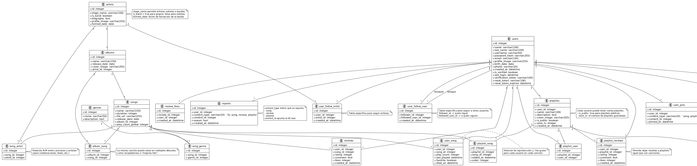

# App WaveUl

## Descripción

WaveUl es una aplicación móvil desarrollada en Flutter para Android que funciona como una plataforma de streaming musical integral, permitiendo a los usuarios explorar, escuchar y gestionar sus canciones y playlists favoritas online. La aplicación ofrece una experiencia personalizada donde los oyentes pueden mantener un perfil detallado, descubrir nuevos artistas y álbumes a través de un catálogo organizado por géneros, y valorar sus canciones con funciones de “me gusta” e historial de reproducciones. El caso de negocio se centra en democratizar el acceso a la música, proporcionando una plataforma centralizada y fácil de usar que fomente la interacción musical y sirva como puente entre artistas, productores y el público final.

El backend, construido con Ruby y el framework Sinatra, junto con una base de datos SQLite3, sirve como el núcleo robusto y eficiente que soporta todas las operaciones de la aplicación. Gestiona de forma ágil la autenticación de usuarios, las transacciones de datos de canciones, álbumes, artistas y playlists, además del procesamiento de estadísticas de reproducción. Este sistema está diseñado para ser escalable y de alto rendimiento, garantizando una experiencia fluida y responsiva para el usuario final, mientras que su simplicidad y bajo costo de operación se alinean con el objetivo de negocio de ofrecer un servicio sostenible y de calidad.

## Configuración del Ambiente de Desarrollo

1. Configuración del backend en Ruby

    Descargar Ruby Windows Installer del <a href="https://rubyinstaller.org/downloads/">Sitio Oficial</a> como se aprecia en la Imagen 1.
    
    <b>Figura 1: Sitio Web de RWI</b>

    -Instalar Ruby y asegurarse de marcar la opción para instalar MSYS2.

    -Verificar la instalación con el siguiente comando: ruby -v
    
    -Instalar Sinatra y las dependencias necesarias:
    gem install sinatra sqlite3

2. Configuración del Entorno Flutter

    Descargar Flutter SDK desde el <a href="https://docs.flutter.dev/get-started/install">sitio oficial</a>.

    Extraer el SDK en una carpeta de fácil acceso (ejemplo: C:\src\flutter).

    Configurar la variable de entorno PATH agregando la ruta a la carpeta flutter\bin.

    Verificar la instalación ejecutando:
    

## Modelo Relacional (ERD)

A continuación, se presenta el modelo relacional de **WaveUl**, que organiza la información en torno a usuarios, artistas, canciones, playlists y sus interacciones.  

  
<b>Figura 2: Modelo Relacional de WaveUl</b>  

### Entidades Principales  
- **users** : Información de usuarios (perfil, credenciales, verificación, actividad).  
- **admins** : Subtipo de usuario con roles de administración (ej. superadmin, moderador).  
- **artists** : Artistas solistas o bandas con nombre artístico, biografía, imagen y fecha de formación.  
- **albums** : Colecciones de canciones asociadas a artistas.  
- **songs** : Pistas musicales con duración, archivo, metadatos y fecha de lanzamiento.  
- **genres** : Clasificación musical de canciones por género.  
- **playlists** : Listas de reproducción creadas por usuarios, públicas o privadas.  
- **reviews** : Opiniones y valoraciones de canciones con calificación y comentarios.  
- **follows** : Permite seguir tanto a artistas como a otros usuarios.  
- **reports** : Registros de reportes de contenido inapropiado (canciones, playlists, reseñas). 

### Entidades de Relación  
- **album_song**: Relación N:M entre álbumes y canciones (soporta recopilatorios).  
- **song_genre**: Relación N:M entre canciones y géneros musicales.  
- **song_artist**: Relación N:M entre canciones y artistas (para colaboraciones y feats).  
- **user_song**: Registro de interacciones usuario–canción (reproducciones, favoritos, última vez escuchada).  
- **playlist_song**: Canciones dentro de una playlist, con orden y fecha de adición.  
- **playlist_user**: Relación de colaboración en playlists compartidas entre usuarios.  
- **review_likes**: Relación usuario–reseña que almacena likes en opiniones. 

## Casos de Uso - WaveUl

El sistema WaveUl se organiza en torno a tres tipos de actores principales:

- **Usuario** : oyente de música que explora, reproduce e interactúa con canciones, playlists y artistas.  
- **Artista** : creador de contenido musical, con acceso a herramientas para gestionar su perfil artístico, canciones y estadísticas.  
- **Administrador** : encargado de la moderación, gestión de usuarios y control del catálogo musical.  

  
**Figura 3: Diagrama de Casos de Uso de WaveUl**

---

###  Autenticación y Perfil
- **Registrar cuenta (UC1)**: permite a nuevos usuarios crear un perfil en la app.  
- **Iniciar sesión (UC2)**: acceso de usuarios, artistas y administradores a sus respectivos paneles.  
- **Recuperar contraseña (UC3)**: recuperación mediante correo/token de verificación.  
- **Gestionar perfil (UC4)**: actualización de información personal, foto de perfil y ajustes de seguridad.  

---

###  Exploración y Descubrimiento
- **Explorar canciones (UC5)**: navegar por el catálogo general.  
- **Buscar música (UC6)**: búsqueda avanzada por nombre, género, artista o álbum.  
- **Explorar artistas (UC7)**: consulta de perfiles artísticos y discografía.  
- **Explorar géneros (UC8)**: descubrimiento de música organizada por categorías musicales.  
- **Explorar álbumes (UC9)**: visualización de discos publicados por artistas.  
- **Explorar playlists (UC27)**: acceso a playlists públicas y destacadas.  
- **Explorar perfiles (UC28)**: posibilidad de visitar perfiles de otros usuarios.  

---

###  Reproducción e Interacción
- **Reproducir canciones (UC10)**: incluye controles de play/pause, skip, volumen, repeat y añadir a playlists.  
- **Gestionar playlists (UC11)**: crear, editar, eliminar, compartir y organizar playlists.  
- **Dar like/me gusta (UC12)**: marcar canciones o reseñas como favoritas.  
- **Crear reseñas (UC13)**: permitir a los usuarios opinar y valorar canciones.  
- **Ver reseñas (UC31)**: lectura de comentarios y puntuaciones de la comunidad.  
- **Seguir artistas/usuarios (UC14)**: suscripción a contenido de interés.  
- **Reportar/Ocultar contenido (UC29)**: denunciar o bloquear canciones, usuarios, reseñas o playlists.  

---

###  Biblioteca Personal
- **Ver historial de reproducción (UC15)**: acceso al registro de canciones escuchadas.  
- **Ver canciones favoritas (UC16)**: listado de temas marcados con “me gusta”.  
- **Ver playlists creadas (UC17)**: gestión de playlists propias.  
- **Ver nuevas recomendaciones (UC30)**: sugerencias personalizadas basadas en hábitos de escucha.  

---

###  Panel del Artista
- **Gestionar perfil artístico (UC18)**: edición de biografía, imágenes, redes sociales y datos de la banda/solista.  
- **Subir canciones (UC19)**: carga de pistas nuevas al catálogo.  
- **Gestionar álbumes (UC20)**: creación y edición de álbumes.  
- **Ver estadísticas (UC21)**: análisis de reproducciones, seguidores, demografía y tendencias.  

---

###  Panel de Administración
- **Gestionar usuarios (UC22)**: alta, baja o suspensión de cuentas.  
- **Gestionar contenido (UC23)**: control sobre canciones, álbumes y artistas cargados.  
- **Moderar reseñas (UC24)**: validación y moderación de opiniones de la comunidad.  
- **Gestionar géneros (UC25)**: administración de categorías musicales.  
- **Ver reportes (UC26)**: análisis y seguimiento de contenido denunciado.  

---